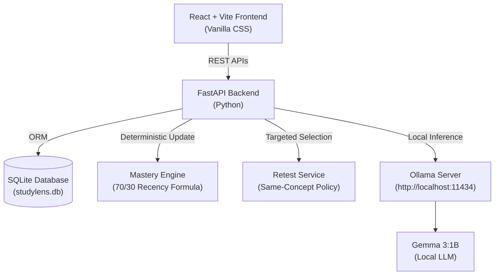

# StudyLens

> **A private, local-AI tool that estimates recurring concept-level weaknesses from student answer patterns and adapts subsequent assessments accordingly.**

---

## 📌 Problem

Conventional assessment systems often provide a simple percentage score or binary pass/fail grade, but fail to continuously identify *which specific underlying concepts* a student repeatedly misunderstands. Without targeted, adaptive retesting, students often repeat the same conceptual mistakes without receiving feedback tailored to their specific misconceptions.

## 💡 Solution

StudyLens addresses this challenge using an adaptive, closed-loop evaluation workflow powered entirely by a **local AI model (Gemma 3:1B via Ollama)** and a **deterministic Python mastery engine**:

```
Student Answer
  └─► Local Gemma 3:1B AI Analysis (Understanding Score & Misconceptions)
        └─► Deterministic Mastery Engine (Recency-Weighted Score Update)
              └─► Adaptive Retest Policy Check
                    └─► Targeted Same-Concept Question Selection
                          └─► Student Reassessment & Progress Tracking
```

---

## 🏗 Key Technical Architecture & Design

StudyLens strictly separates **natural language interpretation** from **authoritative mastery and retest decision-making**:



### 1. Local AI Layer (Gemma 3:1B via Ollama)
- Interprets free-text written answers.
- Scores understanding on a 0–100 scale.
- Identifies active curriculum concepts.
- Detects specific conceptual misconceptions.
- *The AI is strictly an interpreter and NEVER modifies database records directly or makes retest decisions.*

### 2. Deterministic Backend (Python & SQLAlchemy)
- **Mastery Engine**: Updates concept mastery deterministically using a recency-weighted formula:
  $$\text{New Mastery} = (\text{Previous Mastery} \times 0.70) + (\text{Current Score} \times 0.30)$$
- **Mastery Levels**:
  - `0.0 – 39.9`: **Weak** (Always triggers targeted retest)
  - `40.0 – 59.9`: **Developing** (Triggers retest if misconceptions exist)
  - `60.0 – 79.9`: **Proficient** (No immediate retest)
  - `80.0 – 100.0`: **Strong** (No immediate retest)
- **Retest Policy**: Selects targeted, active questions from the **same concept**, preferring unattempted questions before falling back deterministically.

---

## ✨ Features

- 🔒 **Local AI Processing**: Analyzes student answers locally using Ollama and Gemma 3:1B without cloud dependencies.
- 🎯 **Targeted Retesting**: Automatically selects unanswered questions belonging to weak or developing concepts.
- 📊 **Deterministic Mastery Engine**: Uses recency-weighted math to ensure recent performance reflects current mastery.
- 🛡️ **Coupling Misconception Protection**: Prevents false-positive misconception flags when students correctly explain low/high coupling.
- ⚡ **Duplicate Submission Protection**: Server-side guard prevents rapid duplicate requests from creating duplicate attempt records.
- 💻 **Dark Cyan/Teal AI Dashboard**: Responsive student dashboard built with React and Vanilla CSS (no Tailwind dependency).

---

## 🚀 Local Setup Instructions (Windows)

### Prerequisites
1. **Python 3.10+** (Tested on Python 3.13)
2. **Node.js 18+** & **npm 9+**
3. **Ollama** installed locally with the `gemma3:1b` model:
   ```powershell
   ollama pull gemma3:1b
   ```

### 1. Start Backend Server
```powershell
cd backend
python -m pip install -r requirements.txt
python -m uvicorn app.main:app --host 127.0.0.1 --port 8000
```
Backend will be live at `http://127.0.0.1:8000`. API documentation is available at `http://127.0.0.1:8000/docs`.

### 2. Start Frontend Server
Open a second terminal window:
```powershell
cd frontend
npm install
npm run dev
```
Frontend will be live at `http://localhost:5173/`.

---

## 🧪 Testing & Evaluation

### Backend Unit & Integration Tests
Run the automated test suite covering database models, seed idempotency, mastery formulas, AI parsing, and adaptive retesting:
```powershell
python -m pytest backend/tests/
```
*Current test status: **52 passed, 0 failed**.*

### Running the Local AI Evaluation Harness
To run the evaluation dataset against the live local backend:
```powershell
python evaluation/run_evaluation.py
```

---

## 🎬 Quick Demo Workflow

**Demo video:** https://youtu.be/fmw0NHtx7vI

1. Start Ollama, Backend, and Frontend.
2. Open `http://localhost:5173/` in your browser.
3. Navigate to **Assessment** and answer:
   - **Question**: *"What is meant by high coupling in software design?"*
   - **Answer**: *"High coupling means modules depend strongly on each other. This is usually undesirable because changing one module can affect other modules."*
4. Observe local AI analysis score (`90/100`), evidence, and updated mastery (`Strong`).
5. Answer a weak/misconception answer on another question:
   - **Answer**: *"High coupling is good because all code is in one giant file."*
6. Observe the detected misconception, updated mastery (`Developing`), and the **Targeted Retest Card**. Click **Continue Retest** to proceed to the next same-concept question.

---

## 🔒 Privacy Notice & Limitations

- **Privacy Design**: Designed for local processing and does not require sending student answers to a cloud AI provider for core analysis.
- **Model Characteristics**: Uses Gemma 3:1B, a lightweight open-weight 1-billion parameter model optimized for local execution. While private and fast, small local open-weight models may occasionally generate over-inclusive misconception lists despite correctly understanding and scoring the answer.
- **Hardware Dependencies**: Inference latency depends on local GPU/CPU hardware (averages ~22s per request on local CPU).
- **Curriculum Scope**: Current seed dataset contains 11 core Software Engineering concepts and 15 curated questions.

---

## 📄 License

This project is open-source under the [MIT License](LICENSE).
Third-party libraries and model weights belong to their respective owners.

